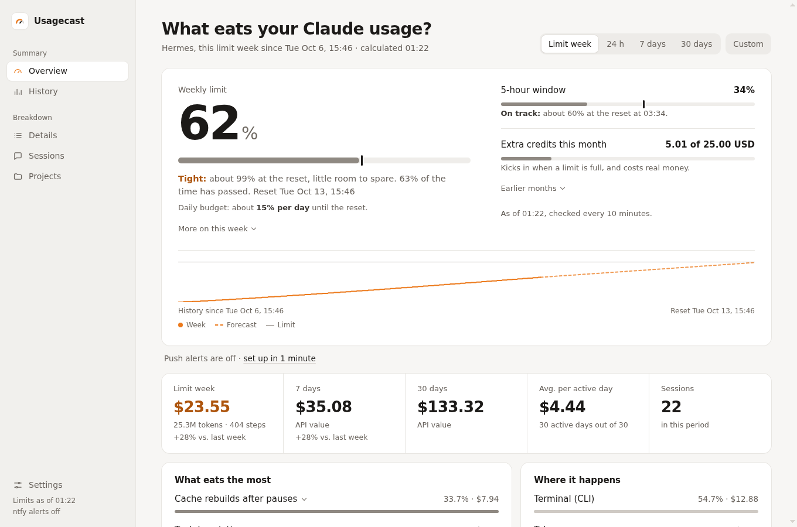
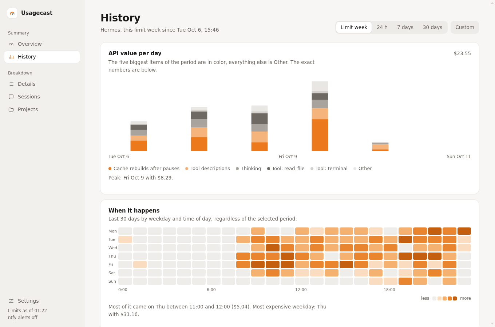
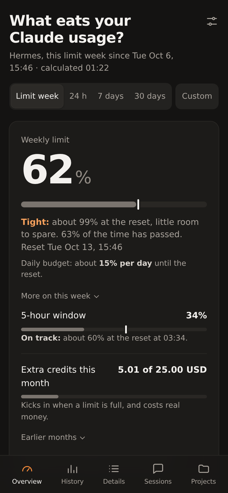

# Usagecast

[](https://github.com/Louis-Lastella/usagecast/actions/workflows/test.yml)

[English](README.md) · **Deutsch**

Selbst gehostetes Dashboard, das zeigt, was deine KI-Usage frisst. Im Moment liest es
[Hermes Agent](https://github.com/NousResearch/hermes-agent) mit Anthropic Claude und schlüsselt die Kosten auf: jedes
Tool, jeder Skill, jedes Plugin, jeder Teil des Systemprompts, Denken, Hintergrund-Prüfung, Cache-Neuaufbau nach Pausen
und Cache-Brüche. Dazu kommen die Abo-Limits (5 Stunden, Woche, Extra-Guthaben) mit Prognose, Warnungen aufs Handy und
konkrete Spartipps aus den eigenen Daten, mit dem `hermes`-Befehl, der sie umsetzt.

Nur Python-Standardbibliothek. Es liest `~/.hermes/state.db` und `~/.hermes/logs/agent.log*` nur lesend. Keine KI:
Rangliste, Aufteilung, Prognose und Spartipps sind feste Rechenregeln, es geht nie eine Anfrage an ein Modell raus.

Läuft mit jeder Hermes-Installation. Welche Plugins und welcher Memory-Anbieter aktiv sind, liest es aus `config.yaml`
(`plugins.enabled`, `memory.provider`) und ordnet deren Teile im Systemprompt und an den Nachrichten danach zu.
SOUL.md, Hermes' eigene Hinweise und die Herkunft (Telegram, Discord, Slack, Cron-Jobs ...) erkennt es ebenfalls selbst.



Ohne Hermes ausprobieren: `python3 app.py --demo` startet es mit einem Monat erfundener Daten.

## Seiten

| Seite | Inhalt |
|---|---|
| `/` | Limits mit Tempo, Tagesbudget und Prognose, Kennzahlen mit Vergleich zur Vorwoche, Rangliste was am meisten frisst, Herkunft, Modelle, Spartipps |
| `/history` | Kosten pro Tag nach den größten Posten mit Markern für Hermes-Updates und Config-Änderungen, diese Woche über den drei davor, Heatmap nach Wochentag und Uhrzeit, Aktivitätskalender, Tagestabelle |
| `/details` | Alle Tools, Skills, Plugins, Systemprompt-Teile und Tool-Beschreibungen einzeln, Cache-Brüche mit wahrscheinlicher Ursache, die zehn teuersten einzelnen Tool-Ergebnisse |
| `/sessions` | Teuerste Sessions mit Herkunft und letzter Aktivität unter jedem Titel, einer Filterreihe und Suche; der Chip Cron-Jobs zeigt Kosten pro Lauf und Woche. Eine Session-Seite zeigt jeden Schritt und den Befehl `hermes --resume <id>` |
| `/projects` | Kosten pro Projekt, antippen zeigt die Sessions dazu |
| `/settings` | Darstellung, Limit-Anzeige, Warnungen und Push-Einrichtung |
| `/api/summary` | Limits, Prognose und Kosten der Limit-Woche als JSON, für Widgets |

Zeitraum per `?p=w` (seit dem letzten Reset des Wochenlimits, Standard), `?p=1`, `?p=7`, `?p=30` oder ein eigener
Zeitraum wie `?p=2026-10-01..2026-10-07` (Knopf „Eigener“).



Hell und dunkel folgen der Systemeinstellung. Auf dem iPhone in Safari öffnen und „Zum Home-Bildschirm“ wählen, dann
startet es wie eine App.



## Sprachen

Standard ist Englisch. Auf Deutsch schaltest du über den Link unten auf jeder Seite oder mit `?lang=de`, die Wahl bleibt
per Cookie gespeichert. Mit `USAGECAST_LANG=de` ist Deutsch der Standard für Dashboard und Warnungen.

Alle Texte stehen in `locales/<code>.json`. Für eine neue Sprache `locales/en.json` kopieren, die Werte übersetzen und
`python3 app.py --test` laufen lassen. Der Selbsttest prüft, dass jede Sprache dieselben Schlüssel und Platzhalter hat
und jede Seite ohne übrig gebliebene Schlüssel rendert.

## So wird gerechnet

1. **Echte Kosten:** `session_model_usage` enthält pro Session die Tokens, die Anthropic gemeldet hat (Input,
   Cache lesen, Cache schreiben, Output). Mit der offiziellen API-Preisliste (`PRICES` in `app.py`) ergibt das den
   exakten API-Gegenwert. Beim Pro- oder Max-Abo zählt Anthropic das Limit nach denselben Gewichten.
2. **Aufteilung:** Jede Session wird Schritt für Schritt nachgespielt. Für jeden API-Call ist bekannt, was im Prompt
   stand (Systemprompt-Teile, Tool-Beschreibungen, jede Tool-Rückgabe, Plugin-Einblendungen, Nachrichten, Denken),
   was neu dazukam und was aus dem Cache kam.
3. **Cache:** Wo Hermes' `agent.log` den Call hat (`in=… cache=…`), zählt der echte Cache-Wert. So werden auch
   Cache-Brüche ohne Pause sichtbar. Sonst gilt die Regel: nach mehr als `cache_ttl` (5 min oder 1 h) Pause ist der
   Cache weg.
4. **Eichung:** Größen kommen aus der Textlänge (Bilder pauschal) und werden pro Session auf die echten Token-Zahlen
   skaliert. Die Summe aller Posten ist immer exakt gleich den echten Kosten (der Selbsttest prüft das).
5. **Zeitraum:** Kosten zählen nach dem Zeitpunkt jedes einzelnen Schritts. Eine Session, die vor dem Zeitraum begann,
   zählt nur mit dem Teil, der in den Zeitraum fällt.

Denken, das Hermes nicht als Text ablegt, wird aus der Differenz zum echten Output ergänzt und bleibt wie gespeichertes
Denken im Verlauf.

**Projekte:** Hermes speichert nur bei Sessions im Terminal einen Arbeitsordner. Alle anderen Sessions zählen zu dem
Projekt, dessen Pfad in ihren Tool-Aufrufen am häufigsten vorkommt: Ordner unter `/opt` und `/srv` sowie Git-Repos im
Home-Ordner (auch eine Ebene tiefer, etwa `~/projects/app`). Hermes' eigener Ordner zählt nur, wenn sonst kaum etwas
vorkommt.

**Prognose:** Das 5-Stunden-Fenster wird aus dem Tempo der letzten Stunde hochgerechnet. Für die Woche testet Usagecast
an deinen letzten vollen Limit-Wochen zwei Verfahren: eine gerade Linie aus dem Tempo seit dem Reset und deinen
Wochenrhythmus (welcher Anteil der Kosten einer üblichen Woche bis zu dieser Stunde anfällt). Der Rhythmus zählt, wenn er
mindestens 10 % genauer ist; der Ausklapptext unter dem Wochenlimit nennt Verfahren und beide Abweichungen (Ergebnis in
`data/forecast.json`).

**Tempo und Budget:** Ein Strich auf jedem Limit-Balken zeigt, wie viel vom Fenster schon vorbei ist. Liegt die
Prognose über 100 %, heißt es „Zu schnell“ mit der Uhrzeit, zu der das Limit voll ist, bei 85 bis 100 % „Knapp“, darunter
„Im Plan“ mit dem erwarteten Stand zum Reset. Die Linie unter den Limits zeigt die laufende Limit-Woche mit der
100-%-Linie und gestrichelt die Prognose bis zum Reset. Das Tagesbudget ist der Rest der Woche geteilt durch die Tage bis zum Reset. Meldet die
Statusseite von Anthropic eine Störung, steht unter den Limits eine Zeile dazu.

**Aufteilung des Limits:** Aus den Limit-Messungen alle 10 Minuten und den Kosten pro Stunde schätzt Usagecast, wie viel
API-Gegenwert ein Prozent deiner Woche ist. Damit teilt es die Woche in Hermes, Claude Code (Sessions in
`~/.claude/projects` auf demselben Rechner oder von anderen Rechnern gemeldet, siehe unten) und den Rest (claude.ai,
die Apps). Kosten lassen sich statt
in Geld auch als Anteil der Woche anzeigen.

**Preise:** Ein Modell, das in der Preisliste fehlt, bekommt die Preise von Claude Opus und den Hinweis „Preis geschätzt“.

## Einstellungen

Unter `/settings` stellst du die Darstellung ein (hell, dunkel oder System, Sprache, USD oder EUR zum Tageskurs der EZB,
Zahlen kurz oder voll, Standard-Zeitraum), die Limit-Anzeige (verbraucht oder übrig, Kosten in Geld oder in % der Woche)
und jede Warnung einzeln mit Schwelle und Ruhezeiten. Die Werte landen in `data/settings.json`, lesbar nur für den
Besitzer; Umgebungsvariablen geben nur die Standardwerte vor. Gespeichert wird nur, wenn das Formular von Usagecasts
eigener Seite kommt. Hat Hermes Profile (`hermes profile create`), wählst du dort auch, welches
ausgewertet wird; die Limits bleiben gleich, sie gehören zum Konto.

## Warnungen per ntfy

Alle 10 Minuten prüft der Server die Limits und schickt höchstens einmal pro Fenster eine Push-Nachricht, wenn

- das 5-Stunden-Fenster beim Tempo der letzten Stunde bald voll ist (Standard: in 30 Minuten),
- die Wochenprognose über 100 % liegt (frühestens einen Tag nach dem Reset),
- die Woche 80 % und 90 % erreicht,
- das 5-Stunden-Fenster nach einem vollen Fenster wieder frei ist,
- das Extra-Guthaben angezapft wird, und wenn das Guthaben im Monat eine deiner Stufen überschreitet (z. B. 10 und 20,
  standardmäßig aus),
- ein Chat teuer geworden ist: seine letzten drei Antworten kosten je mindestens 0,5 % der Woche (ein neuer Chat liegt
  weit darunter; 0,5 % kosten beim Autor die teuersten 5 % aller Antworten),
- ein einzelner Lauf aus dem Rahmen fällt: ein Cron-Lauf oder eine Antwort kostet das Dreifache des Üblichen und
  mindestens 3 % der Woche.

Die letzten beiden brauchen erst ein paar Tage Limit-Messungen (sie rechnen in % der Woche). Antippen öffnet die Session.

**Budget-Wächter** (standardmäßig aus): Auf `/settings` markierst du wiederkehrende Cron-Jobs, die warten dürfen. Wird
die Woche knapp (Prognose über 100 % ab dem zweiten Tag, Woche bei 90 % oder 5-Stunden-Fenster bei 85 %), pausiert
Usagecast sie mit `hermes cron pause` und setzt sie fort, sobald wieder Luft ist, jeweils mit einem leisen Push. Jobs,
die du selbst pausiert hast, bleiben unangetastet; die Übersicht zeigt, welche Jobs gerade warten.

Am Sonntagabend kommt leise ein Wochenrückblick: Stand der Woche, größter Posten und Vergleich zur Vorwoche.

**Einrichtung in einer Minute:** Auf `/settings` erzeugt „Push einrichten“ ein eigenes, zufälliges Topic auf
[ntfy.sh](https://ntfy.sh). Unter Android öffnet ein Knopf die ntfy-App direkt mit dem Abo, auf dem iPhone kopierst du
das Topic und folgst den drei Schritten dort. „Test senden“ zeigt sofort die Antwort des Servers. Ein eigener
ntfy-Server mit Zugangs-Token geht auch, ebenso Hermes' ntfy-Kanal (`NTFY_HOME_CHANNEL`, `NTFY_SERVER_URL`, `NTFY_TOKEN`
in `~/.hermes/.env`). `USAGECAST_NTFY` (volle URL mit Topic) setzt einen Standard ohne die Einstellungsseite.

## Widgets (iPhone, Home- und Sperrbildschirm)

`widget/usagecast-widget.js` ist ein Skript für [Scriptable](https://scriptable.app), das Wochenlimit und
5-Stunden-Fenster zeigt. In Scriptable ein neues Skript anlegen und den Inhalt einfügen, ein kleines Scriptable-Widget
hinzufügen, das Skript wählen und die Dashboard-Adresse als „Parameter“ eintragen. Es liest `/api/summary`, das Handy
muss das Dashboard also erreichen (zum Beispiel über Tailscale).

Dasselbe Skript läuft auf dem Sperrbildschirm (ab iOS 16): Sperrbildschirm lange drücken, „Anpassen“, den
Sperrbildschirm wählen, auf den Widget-Bereich (oder die Zeile über der Uhr) tippen, Scriptable hinzufügen, dann das
neue Widget antippen, das Skript wählen und die Adresse als „Parameter“ eintragen. Rund zeigt die Woche als Ring,
rechteckig die Woche mit Reset, einen dünnen Balken und das 5-Stunden-Fenster, die Zeile über der Uhr „Week 65% · 5h 6%“.
iOS färbt sie passend zur Uhr ein.

## Claude Code auf anderen Rechnern

Claude Code auf einem Laptop nutzt dieselben Limits, schreibt seine Transkripte aber dort. `tools/cc-report.py`
(Standardbibliothek, Python 3.9 oder neuer) summiert die Token-Zahlen pro Stunde und Modell und schickt nur diese Zahlen
alle 10 Minuten ans Dashboard; die Limit-Aufteilung zählt sie dann als Claude Code. Auf `/settings` unter „Andere
Rechner“ einen Token erstellen und den dort gezeigten Befehl auf dem anderen Rechner ausführen, zum Beispiel

```sh
curl -fsSO https://dashboard.example:8443/cc-report.py
python3 cc-report.py --url https://dashboard.example:8443 --token TOKEN --install
```

Auf dem Mac lädt das einen LaunchAgent (`dev.usagecast.report`, alle 10 Minuten), unter Linux gibt es eine
crontab-Zeile aus. `--dry-run` zeigt, was gesendet würde. Die Einstellungen liegen in `~/.config/usagecast/report.json`
(Rechte 600). Der Endpunkt ist `POST /api/ingest` mit `Authorization: Bearer <token>`; ein neuer Token auf `/settings`
sperrt den alten aus.

## Betrieb

```bash
python3 app.py --test        # Selbsttest
python3 app.py --ntfy-test   # Test-Nachricht an ntfy schicken
python3 app.py --demo        # erfundene Daten, liest nichts aus Hermes, schickt keine Warnungen
PORT=7681 python3 app.py     # Server auf 127.0.0.1:7681
```

| Variable | Bedeutung |
|---|---|
| `PORT` | Port auf 127.0.0.1, Standard 7682 |
| `HERMES_HOME` | Hermes-Ordner, Standard `~/.hermes` |
| `USAGECAST_DATA` | Ablage für Messungen und Limit-Verlauf, Standard `data/` neben `app.py` |
| `USAGECAST_LANG` | Standardsprache, `en` (Standard) oder `de` |
| `USAGECAST_NTFY` | ntfy-Ziel, falls nicht aus Hermes |
| `USAGECAST_URL` | Standard für die Dashboard-Adresse in den Einstellungen, ein Tipp auf die Warnung öffnet sie |

Im Hintergrund misst der Server einmal am Tag Systemprompt und Tool-Beschreibungen (`--snapshot`, läuft im
Hermes-venv) und holt alle 10 Minuten die Abo-Limits über Hermes' OAuth-Login. Der Token verlässt dabei den
Hermes-Prozess nicht. Beides landet in `data/`.

`usagecast.service` ist eine Vorlage für einen systemd-Benutzerdienst mit dem Repo unter `~/usagecast`.

## Lizenz

MIT, siehe [LICENSE](LICENSE).
